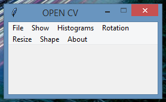

# Opencv-Project

An all in one project with the "open cv" basic knowledge

 

# Table of contents

<!--ts-->
  * [Opencv-Project](#Opencv-Project)
  * [Table of contents](#Table_of_contents)
  * [Files/Folders](#Files/Folders)
  * [Dependencies](#Dependencies)
  * [Current Version](#Current_Version)
  * [Radon](#Radon)
    * [Radon_cc](#Radon_cc)
    * [Radon_raw](#Radon_raw)
    * [Radon_hal](#Radon_hal)
    * [Radon_mi](#Radon_mi)
  * [Keybinds](#Keybinds)
  * [License](#License)
<!--ts-->

## Files
<ul>
 <li> images (images folder) </li>
 <li> OPEN_CVGUI.py(main file) </li>
 <li> keybinds.txt(.txt keybinds file) </li>
</ul>

## Dependencies

 <ul>
  <li> OpenCv </li>
  <li> numpy </li>
  <li> matplotlib </li>
</ul>

## Current Version

 

## Radon

### Radon_cc

 

### Radon_raw

 

### Radon_hal

 

### Radon_mi

## Keybinds 

 <ul>
  <li>Load Image(Alt+O)</li>
  <li>Save Image(Ctrl+S)</li>
  <li>Exit(Alt+F4)</li>
  <li>Show Image(Ctrl+F5)</li>
  <li>Show Gray(Ctrl+G) </li>
  <li>Show HSV(Ctrl+F9)</li>
  <li>Show LAB(Ctrl+L)</li>
  <li>Grayscale Histograms(Alt+H)</li>
  <li>Color Histograms(Alt+C)</li>
  <li>Histogram Equalization(Alt+E)</li>
  <li>45 Degrees(Ctrl+4)</li>
  <li>90 Degrees(Ctrl+9)</li>
  <li>180 Degrees(Ctrl+R)</li>
  <li>Show Width(Ctrl+W)</li>
  <li>Show Height(Ctrl+H)</li>
  <li>Show Channels(Ctrl+C)</li>
  <li>About(Ctrl+I)</li>
  <li>Help(Ctrl+F1)</li>
</ul>

## License
[GNU GPLv3](https://choosealicense.com/licenses/gpl-3.0/)

