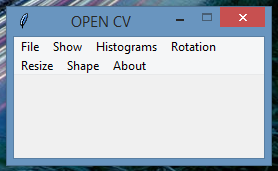

# Opencv-Project

An all in one project with the "open cv" basic knowledge

## Dependencies

 <ul>
  <li> OpenCv </li>
  <li> numpy </li>
  <li> matplotlib </li>
</ul>

**Current Version**

 

## Keybinds 

 <ul>
  <li>Load Image(Alt+O)</li>
  <li>Save Image(Ctrl+S)</li>
  <li>Exit(Alt+F4)</li>
  <li>Show Image(Ctrl+F5)</li>
  <li>Show Gray(Ctrl+G) </li>
  <li>Show HSV(Ctrl+F9)</li>
  <li>Show LAB(Ctrl+L)</li>
  <li>Grayscale Histograms(Alt+H)</li>
  <li>Color Histograms(Alt+C)</li>
  <li>Histogram Equalization(Alt+E)</li>
  <li>45 Degrees(Ctrl+4)</li>
  <li>90 Degrees(Ctrl+9)</li>
  <li>180 Degrees(Ctrl+R)</li>
  <li>Show Width(Ctrl+W)</li>
  <li>Show Height(Ctrl+H)</li>
  <li>Show Channels(Ctrl+C)</li>
  <li>About(Ctrl+I)</li>
  <li>Help(Ctrl+F1)</li>
</ul>
